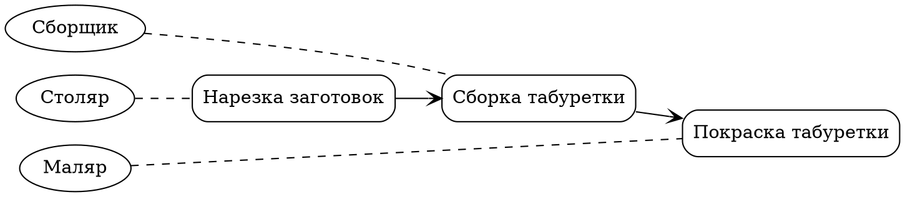
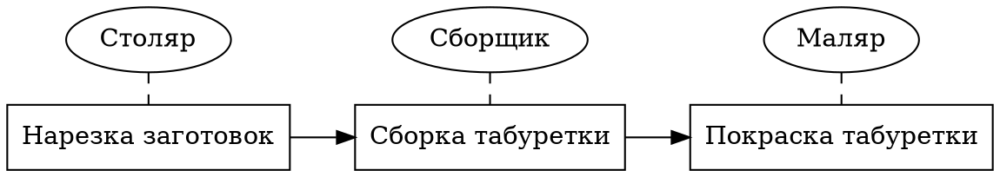

### deepseek-VAD
https://chat.deepseek.com/a/chat/s/9b226c3e-bd00-407e-a7e0-d1ec58a66558

Есть бизнес-процесс:
Столяр нарезает заготовки. Сборщик собирает из заготовок табуретку. Маляр красит табуретку. 
Нарисуй схему VAD этого бизнес-процесса. 
Нотация VAD подразумевает, что исполнитель подписывается отдельно под соответствующим процессом. Представить указанный процесс в графической форме. Если не можешь вывести рисунок, то составить схему VAD на языке dot и укажи в каком on-line редакторе ее посмотреть.

Вот схема бизнес-процесса в нотации VAD (Value-Added Chain Diagram) на языке DOT. Вы можете визуализировать её в любом онлайн-редакторе, например, [Graphviz Online](https://dreampuf.github.io/GraphvizOnline) или [PlantText](https://www.planttext.com/):



### Как это выглядит в VAD:
1. **Исполнители** (роли) отображаются в виде эллипсов под процессами
2. **Процессы** (действия) — прямоугольники с закруглёнными углами
3. **Поток создания ценности** — стрелки между процессами
4. **Связи исполнителей** — пунктирные линии без стрелок

### Альтернативный текстовый вариант схемы (если DOT не поддерживается):
```
[Столяр]  [Сборщик]  [Маляр]
   |          |          |
   v          v          v
[Нарезка] -> [Сборка] -> [Покраска]
```

Для более точной визуализации рекомендую скопировать код DOT в онлайн-редактор.

в коде dot не отражено условие: 
Исполнители (роли) отображаются в виде эллипсов под процессами
т.е. отображение исполнителя не под соответствующим ему процессом. Кроме того, VAD - элементы - это "не прямоугольники с закруглёнными углами". VAD - элементы должны быть направленными.

Вы правы, в VAD (Value-Added Chain Diagram) процессы обычно изображаются **прямоугольниками без скруглений**, а связи между ними — **направленными стрелками**. Исполнители (роли) должны быть **строго под процессами**, с которыми они связаны.  

Исправленный код **DOT** для корректной VAD-схемы:  



### Ключевые исправления:
1. **Форма процессов** — `shape=box` (прямоугольник без скруглений).  
2. **Направленность** — стрелки между процессами (`->`) без лишних элементов.  
3. **Исполнители под процессами** — через `rank=same`, чтобы роли располагались строго под соответствующими процессами.  
4. **Стиль связей** — пунктирные линии (`style=dashed`) без направления (`dir=none`).  

### Визуализация:
- Вставьте код в [Graphviz Online](https://dreampuf.github.io/GraphvizOnline) — получится схема, где:  
  - Процессы идут слева направо.  
  - Под каждым процессом находится исполнитель (эллипс).  
  - Связи "роль — процесс" отображены пунктиром.  

Пример итогового вида (текстовое описание):  
```
[Нарезка] -> [Сборка] -> [Покраска]
   |            |            |
(Столяр)    (Сборщик)    (Маляр)
``` 

Если нужно добавить входы/выходы (например, материалы или готовые изделия), уточните — дополню схему.
