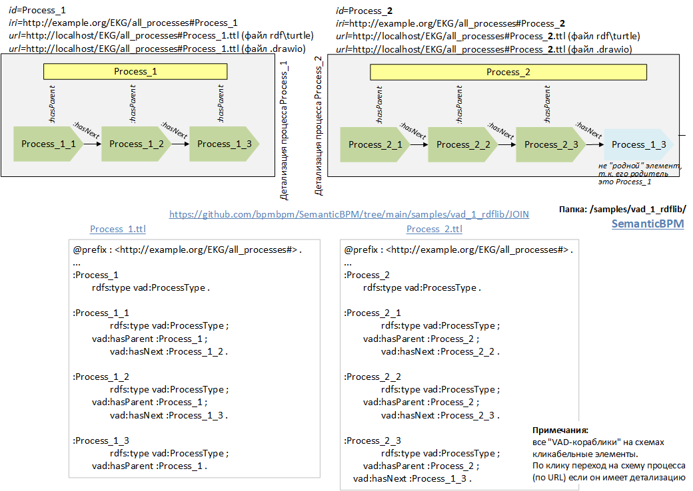

# ProcessMetaModel (метаМодель процесса). Triples vs Quads
## 1 Основная часть
Все объекты включаются в дерево и в графы. В дерево объект входит только один раз и на основе адреса в дереве формируется уникальный адрес объекта. Для простоты будем считать, что объект – это процесс или его подпроцесс. 
Таким образом, есть
1. дерево процессов – это иерархический справочник (таксономия) процессов, на основе которого формируется адрес id \ iri процесса, а также его url – адрес, куда будет переход по клику из любой схемы EKG.
2. схема процесса, читай граф процесса, точнее локальный граф - в нем нет всех связей с элементами этого процесса, см. схему Process_1 – где не показана связь с Process_1_3, которая показана на схеме Process_2.
На рис. ниже зеленым показаны «родные» процессы (собственные), а синим «чужие» (заимствованные) процессы. Для «родных» процессов используем отношение :hasParent, а для чужих или ничего или :isExt (is external). Таким образом на схеме (графе) есть как собственные, так и заимствованные элементы. 

Задача – определить дерево  идентификаторов и принцип кодификации объектов.  
Вопрос: как лучше выстроить онтологию, как лучше кодировать (IRI \ URL) и упаковывать с файлы RDF? 
**Вариант «Triple»** gоказан на рисунке:

Оба файла .ttl лежат в [samples/vad_1_rdflib/JOIN](https://github.com/bpmbpm/SemanticBPM/tree/main/samples/vad_1_rdflib/JOIN). Их загрузка в triple store показана в exSparql_2.js

**Вариант Quad** подразумевает запись квадро с указанием идентификатора схемы (графа). Такая кодификация при замешивании любых файлов с триплетами позволит легко определять принуждённость элементов к конкретной схеме. При формировании triple store по варианту «Triple» выделение состава конкретной схемы процесса усложняется.

Общие предпосылки:
1. Один файл = одна схема (один граф) 
2. По URL обеспечивается доступ к элементу, который или идентичен IRI или легко сопоставим. Даже если не будет вызываться (не сможем рендерить в real-time) «хх.drawio» (или yEd), то будет одноименный html или svg.    
В пути URL \ IRI:
- EKG [Enterprise Knowledge Graph]( https://github.com/bpmbpm/doc/blob/main/README.md#enterprise-knowledge-graph)
- all_processes – папка \ ресурс со всеми процессами.
  
В целом: обсуждаем задачу кодирования \ идентификации (id, iri) объектов схемы процесса: процесса (желтый прямоугольник – название схемы) и его подпроцессов в виде VAD-корабликов. Сценарий: поиск элемента (процесса \ подпроцесса, схемы процесса) встроенным запросом или SPARQL и по результату запроса переход к нужной схеме (вывести схему в окно схем) и активировать нужный элемент схемы (перевести фокус на элемент, shape).   
Вопросы редактирования графики, формирование файлов RDF из .drawio \ yEd, загрузка RDF – файлов в triple store – тут не затрагиваем.     
Будем копии объектов (заимствованные процессы) назвать именно дубликатами, а не экземплярами, т.к. «экземпляром процесса» обычно называют исполняемый экземпляр – как запущенный процесс по шаблону «образа процесса»: мир идей vs мир вещей. Образ процесса (рисунок) vs экземпляр процесса (реально исполняемый). В ARIS – подобных системах нет исполняемых экземпляров процессов, в отличие от [WFE систем \WFE-engine]( https://habr.com/ru/articles/866822/).
## 2 Более подробное описание (для понимания будущих проблем)
[Рис. 1 Базовый трафарет VAD – диаграммы и соответствующие семантические конструкции]
(https://habr.com/ru/articles/828266/) показан более сложный вариант (предшествующий, последующий, элементы комментирования объекта и др.). Предлагаю пока остановится на двух типах (см. "Основная часть"): Основной элемент (собственный) и внешний (заимствованный). Однако все в указанной статье (habr, рис.1) описывает именно подход к кодированию объектов, т.е. ровно то, что мы и хотим определить.  
Итак, Triples or Quads?
## 3 Откуда «ноги / уши растут» свой / чужой (читать опционально, имеет обзорное значение)
В той же статье [Semantic BPM. Онтологическое моделирование верхнеуровневых процессов. VAD](https://habr.com/ru/articles/828266/) уже упоминал аналогию: 
_Принцип схож с ГОСТ 2.711–82 ЕСКД Схема деления изделия на составные части (схема деления изделия \ процесса), где hasParent — это собственные процессы (изделия в 2.711), а isExt (Ext = external) — внешние (заимствованные) процессы (изделия). Это позволяет выстроить стройную иерархию идентификаторов процессов и построить единое дерево процессов на основе их идентификаторов. Обратные отношения показаны в скобках, т. е. это hasChild (имеет потомка) и hasEx (содержит внешний процесс)._ 

Расскажу более подробно. Есть «Схема деления изделия на составные части»: 
[1982](https://meganorm.ru/Data/301/30110.pdf) или [2023]( https://meganorm.ru/Data/816/81671.pdf) там указываются (упрощённо) два типа составных частей: свои и чужие, т.е. изделия собственной разработки и заимствованные у сторонних предприятий. За каждый предприятием закреплен свой Децимальный номер. 
[Децимальные номера](https://habr.com/ru/articles/452376/) имеют все изделия от винтика по программного модуля (ЕСПД).   Помню сцены (30 лет назад), когда Главный конструктор АСУ задумчиво стоит перед схемой деления размером 8х5 метров (склейка из листов А0) с конечными элементами (сотни шт.) на схеме типа «одноплатный компьютер», «радио-модуль пакетной радиостанции», «навигационный приемник» (тогда они были с современный смартфон). Концепт «схемы деления предприятия на составные части» близок к EKG. 

Аналогия в том, что схема бизнес-процесса – это аналогия схемы изделия: все «свои» составные части обозначаются одним типом «вновь разработанные изделия» - у нас это «зеленые» (предикат hasParent c привязкой к родительскому процессу) и «заимствованные» - это у нас синие, считай – «чужие» / сторонние децимальные номера. Каждый элемент (составная часть изделия) имеет свой IRI, называемый децимальным номером составной части.
Пример [схемы деления](https://fizmat.space/engineering/files/%D0%9F%D1%80%D0%B5%D0%B7%D0%B5%D0%BD%D1%82%D0%B0%D1%86%D0%B8%D0%B8/02_K3D27V_Chernovik_Skhemy_delenia_v23Z_2024.pdf)

Кстати и месторасположение объектов, в нашем случае файлов – также идентично. В конструкторской документации есть оригинал (адрес архива, где хранятся оригиналы чертежей) и копии (дубликаты). У нас также: где бы ни встретился (в какой – любо схеме) какой – любо процесс (как заимствованный), он указывает на единственный адрес (IRI \ URL), где лежит его оригинал (оригинал его схемы).  
 

