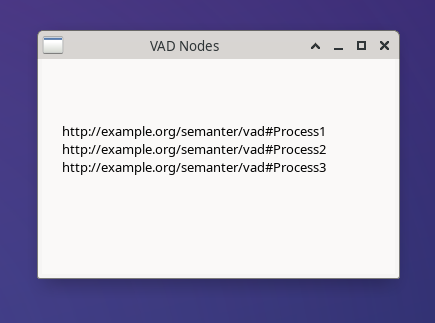

# Инструкция к использованию файлов

В файле **vad_1.drawio.xml** показана структура VAD диаграммы: \

- 3 объекта типа `shape=rectangle;rounded=1`, например:

`id="3" value="Process1"`

- два соединителя, которые заданы через: `source="3" target="4"` (Предшедственник \ Последователь)

Смотреть и редактировать можно из drawio.com

Интеграцию предлагает установить при первой попытке записать файл drawio на github.
Чтобы сохранять в несжатом формате – drawio: `Экспортировать как XML \ Не сжимать. `

# RDF

В RDF уйдут типы объектов (shape=rectangle), например, типом "Process" и связь: Предшедственник (или последователь, т.е. достаточно одной - вторая "обратная")

# Просмотр схем онлайн

- [vad_1 на diagrams.net](https://app.diagrams.net/?src=about#Hbpmbpm%2FSemanticBPM%2Fmain%2FVAD-LD-drawio%2FfileUTF_v1_xml2.drawio.xml#%7B%22pageId%22%3A%228ce9d11a-91a2-4d17-14d8-a56ed91bf033%22%7D)

- [test2](https://app.diagrams.net/?src=about#Hbpmbpm%2FSemanticBPM%2Fmain%2Fsamples%2Fvad_1%2Ftest2.drawio)
  
# Обратный вывод диаграммы в GUI

Обратная задача: по имеющемуся ttl VAD-диаграммы (vad_1.ttl) сделать вывод в графическом интерфейсе. На данный момент делается тривиальный вывод имеющихся IRI узлов типа VAD Process через загрузку ttl в triplestore и отработку SPARQL-запроса:

