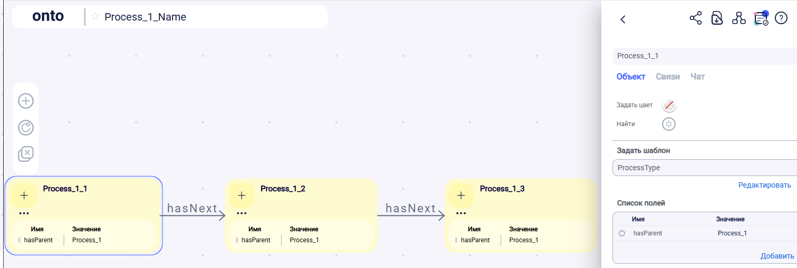

# Осмотр семантических возможностей "Семантической доски" ontonet.ru
## Проверка выгрузки схемы в owl
Операции:
1. Зайти на ontonet.ru: адрес почты + пароль
2. Справа кнопка «+» «Создать пространство»
3. В пространстве создал схему с названием «Process_1_Name» по RDF – файлу «Process_1.ttl»: 
- Создать стикер. Создал три узла: Process_1_1, Process_1_2, Process_1_3. Соединил их линиями (2 шт.).
- Создал шаблон ProcessType и задал его для всех трех узлов.
- Каждому узлу задал свойство hasParent и значение Process_1 (типа он для них родительский).
- Ткнул в жирный «ONTO», далее в шестеренку: «Конфигурация пространства» \ Экспорт пространства.
- Файлик с непонятным названием сохранил с именем onto1.owl.
- Открыл файлик, скопировал содержание и вставил в окно easyrdf.org/converter и далее выгрузил turtle в Process_1_onto.ttl (см. папку)

Process_1_onto.ttl: значимых – только три последних блока. Пытаемся осмыслить из них информацию на примере:
- ns0:Process_1_2
  - a owl:NamedIndividual, ns0:ProcessType ;
  - ns0:hasNext_NS9b9F ns0:Process_1_3 ;
  - ns0:hasParent_zvHrQZ "Process_1" ;

Что понятно: Шаблонизация задается как отношение: ns0:Process_1_2 a ns0:ProcessType .

Что непонятно:
- Почему три последних блока отличаются префиксом? Зачем все предыдущие блоки?
- Почему такое имя отношения (зчем добавлять уникальность к имени?): ns0:hasNext_NS9b9F  и ns0:hasParent_zvHrQZ

Другие вопросы:
- Как выгрузить не все пространство, а только одну схему (выбранную)?
- Как максимально приблизить Process_1_onto.ttl к исходному Process_1.ttl?

[Ссылка на схему в onto](https://app.ontonet.ru/ru/home/operation/E?uuid=e3b69106-4d20-4e9d-9cd6-9027378164c0&realm=d4a500e1-133b-4062-8e92-6c498d431db6)
  

