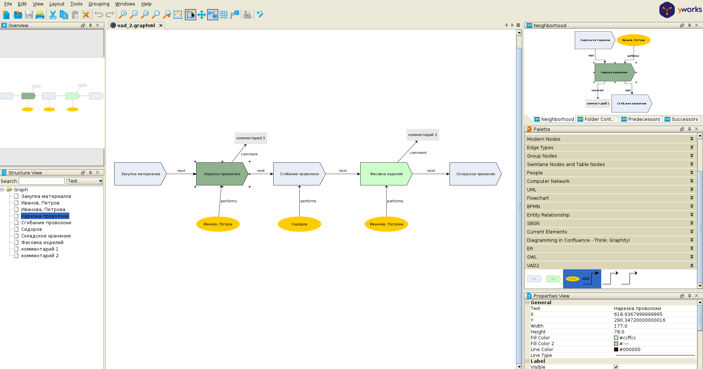
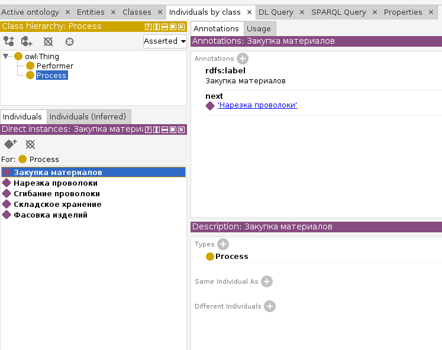

# Парсер graphml диаграмм

Данный прототип демонстрирует возможности создания бизнес-диаграмм в редакторе yEd и их дальнейший парсинг в триплеты RDF.

## Получаем ttl файл из VAD диаграммы

### Скачиваем файлы проекта к себе локально

Можно скачать и разархивировать zip файл со [страницы репозитория на GitHub](https://github.com/bpmbpm/SemanticBPM)

Либо [установить git](https://git-scm.com/book/ru/v2/Введение-Установка-Git) и скачать репозиторий через консоль:

`git clone https://github.com/bpmbpm/SemanticBPM.git`

### Редактируем диаграмму

- Устанавливаем редактор yEd ([страница скачивания инсталлятора](https://www.yworks.com/products/yed/download))
- Открываем редактором файл `samples/vad_2/vad_2.graphml`
- Добавляем палитру VAD:
  - В меню программы: `Edit - Manage Palette`
  - В панели `Available Palette Sections` выбрать `VAD2`
  - Кликаем по `Export Session`
  - `Close` окно Palette Manager
  - Палитра появилась справа на панели `Palette` (проскролльте весь список палитр донизу, чтобы увидеть ее)
  - Теперь в палитре можно выделить текущий элемент и начать редактировать схему
- Редактируем схему, например добавляем элементы и связи из палитры VAD2
- Сохраняем изменения нажатием Ctrl-S

Диаграмма в редакторе yEd выглядит примерно так:

### Устанавливаем инструментарий

Для запуска скрипта необходимо иметь
- установленный [python 3.11](https://www.python.org/downloads/)
- утилиту [Taskfile](https://taskfile.dev/installation/)
  - Для Windows предварительно нужно установить менеджер пакетов [Chocolatey](https://chocolatey.org/install)
- опционально - [валидатор Turtle](https://github.com/IDLabResearch/TurtleValidator)

### Транслируем диаграмму в RDF (Turtle)

Переходим в директорию yed_based_semantizer и набираем в консоли команду

`task parse_vad`

В результате чего в директории `samples/vad_2` появится файл `vad_2.ttl` (или перезапишется новый поверх существующего)

Это валидный rdf, с которым можно проводить различные интересные операции, например загружать в triplstore и искать бизнес-паттерны через sparql-запросы (Какие - для примера напишем в следующих главах повествования).

Так rdf выглдяит в редакторе онтологий [Protege](https://protege.stanford.edu/download/protege/4.3/installanywhere/Web_Installers/):

